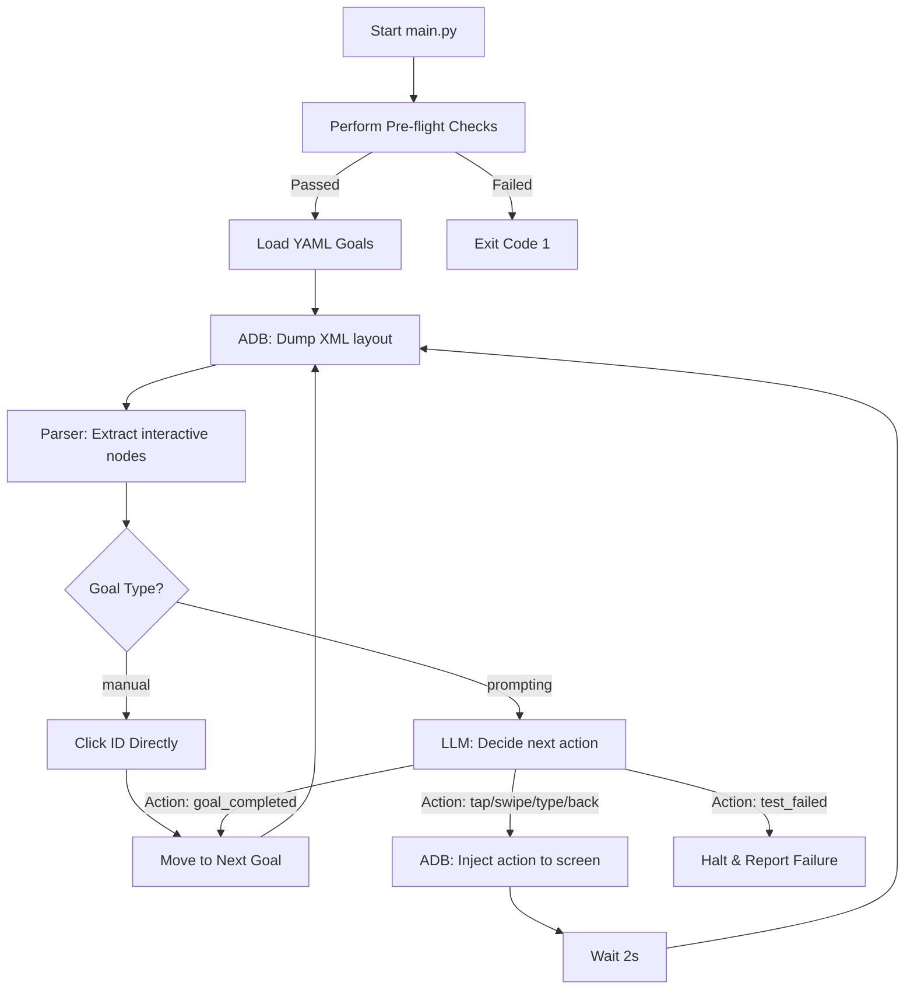

# Android UI Exploration Agent 🤖📱

An automated agent designed to explore and test Android applications using ADB (Android Debug Bridge), XML layout parsing, and Large Language Models (LLMs) like Ollama and OpenAI-compatible APIs. 

Specifically configured out-of-the-box to explore the educational app **MiuLingo** (`com.shadowings.gero`), which teaches Egyptian hieroglyphs.

---

## Key Features
- **Flexible LLM Integration**: Run locally using Ollama (e.g., `qwen3:8b`) or connect to remote OpenAI-compatible completion APIs.
- **Mixed Testing Support**: Support for both YAML-based **manual** (e.g., click ID directly) and **prompting** (delegating decision-making to the LLM) testing goals.
- **Robust Configuration**: Layered configuration system using standard environment variables (`.env`), local JSON overrides (`config.local.json`), and default config templates.
- **Pre-flight Checks**: Automated validations to verify ADB installation, connected Android devices, and configuration completeness before launching.
- **Modular Architecture**: Clean, separate concerns for ADB operations, XML layout parsing, LLM queries, and loop orchestration.

---

## Architecture Flow

The agent runs in a continuous loop, analyzing screen layouts and directing the device:



---

## Getting Started

### Prerequisites

1. **Python 3.8+**
2. **Android SDK Platform-Tools**: Ensure `adb` is installed and available in your shell's `PATH`.
3. **Android Device / Emulator**: USB debugging must be enabled, and the device authorized.
4. **Ollama (Optional)**: For local inference. Install [Ollama](https://ollama.ai/) and run `ollama pull [the model you want to use]`.

### Installation

1. **Clone the Repository**:
   ```bash
   git clone https://github.com/your-username/android-ui-explorer.git
   cd android-ui-explorer
   ```

2. **Set up Virtual Environment**:
   ```bash
   python3 -m venv .venv
   source .venv/bin/activate
   ```

3. **Install Dependencies**:
   ```bash
   pip install -r requirements.txt
   ```

### Device Setup
Ensure your Android device or emulator is:
1. Connected via ADB (`adb devices` should show a `device`).
2. Displaying the landing/starting screen of the target application (e.g. MiuLingo).

---

## Configuration

The agent is entirely configured using environment variables. You can define them in a `.env` file in the root of the project.

### Recommended Setup (using `.env`)
Copy the template environment file:
```bash
cp .env.example .env
```

Open `.env` in a text editor and fill in your settings:
- Change `EXPLORATION_MODE` to `open-ai-compatible` if using an OpenAI-compatible endpoint, and set `OPENAI_API_KEY`.
- Set it to `ollama` to run inference on a local model (default).

---

## YAML Goals Configuration

Each goal file in the `goals/` folder contains a sequence (list) of testing steps. Each step (row) can be either **manual** or **prompting**, enabling fully mixed testing.

### 1. Manual Steps (`type: manual`)
Directly executes predefined ADB interactions on specific elements matching their resource IDs without invoking the LLM. Currently supports the `click id` action:

```yaml
- step: "Open the Compendium section of the app"
  type: manual
  action: "click id"
  id: "bottom_bar_item_compendio"
```

### 2. Prompting Steps (`type: prompting`)
Orchestrates AI-driven exploration. The layout information and step description are passed directly to the LLM to decide the sequence of actions:

```yaml
- step: "Identify and visit all main sections of the app using the bottom_bar buttons"
  type: prompting
```

### Mixed Example
Steps can be combined in a single file to execute mixed manual and prompting pipelines:

```yaml
# goals/02_find_glyph.yaml
- step: "Navigate to the Compendium using manual click"
  type: manual
  action: "click id"
  id: "bottom_bar_item_compendio"

- step: "Find and open the entry for the A1 glyph, then close it"
  type: prompting
```

---

## Running the Agent

To run all sequential goals in the `goals/` folder:
```bash
python main.py
```

To run a specific goal file (e.g., `02_find_glyph.yaml`):
```bash
python main.py 02_find_glyph.yaml
```

---

## Project Structure

```
├── main.py                  # Entry orchestrator and main execution loop
├── .env.example             # Environment variable setup template
├── requirements.txt         # Project dependencies
├── goals/                   # Directory containing exploration YAML goal files
├── prompts/                 # LLM context and system prompt templates
│   ├── APP_CONTEXT.md       # Target app background context
│   └── EXPLORATION_PROMPT.md# Base strategic guidelines for the LLM
└── src/                     # Package source code directory
    ├── __init__.py          # Package initializer
    ├── config.py            # Environment configuration manager
    ├── adb.py               # ADB automation helpers and pre-checks
    ├── parser.py            # UI XML parser and coordinate calculations
    └── llm.py               # Ollama and OpenAI API interface client
```

---

## Contributing
Contributions are welcome! Please fork this repository and submit a pull request with any improvements, such as enhanced scroll/swipe logic, broader app support, or better error resilience.

## Future improvements
- **Enhanced Action Logic**: Implement smarter scrolling/swiping to handle long lists and nested views.
- **Error Handling**: Add more robust error handling and recovery strategies for unexpected app states or ADB issues.
- **State Management**: Implement a more sophisticated state tracking system to avoid redundant actions and improve exploration efficiency.
- **Reporting and Analytics**: Build a reporting system to log exploration paths, successes, and failures for analysis and debugging.